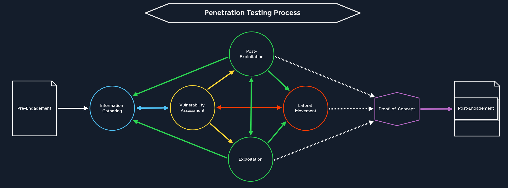

# Introduction to Penetration Testing

Difficulty: Easy
Platform: General
Resources: https://academy.hackthebox.com/app/module/295
Status: Solid
Type: Concept

# What is penetration testing?

- Penetration testing (`pentesting`), or ethical hacking, is where we legally mimic cyberattacks to spot security holes in a company's digital world.
- It's not just about finding weaknesses; it's about checking how well current security measures hold up, helping firms fix issues before the bad guys take advantage of the weaknesses.
- A penetration test is a unique type of security assessment that goes beyond automated scanning and vulnerability identification.
- It involves attempting to exploit discovered vulnerabilities and gain unauthorized access, elevate privileges, or extract sensitive data.
- This approach allows organizations to understand not only what vulnerabilities exist in their infrastructure, but also how they could be leveraged and hardened in a real attack scenario, and what the impact would be.

---

# Penetration testing process

1. It starts with `reconnaissance` (also known as `information gathering`), where testers gather information about the target organization, system, or network, like scouting out a building before planning a break-in.
2. Next, in the `vulnerability assessment` phase, they use tools to spot weak points, similar to checking for unlocked windows or doors.
3. During the `exploitation` phase, testers try to exploit those weaknesses to gain access or control over the system, just as a thief might test those unlocked doors.
4. After that, in the `post-exploitation` phase, they explore what else can be accessed, maintain control, and assess the impact of a successful attack, like seeing how far an intruder could roam inside a building.
5. Finally, the `reporting` phase documents everything: the vulnerabilities found, the risks they pose, and clear steps to fix them, so the system can be secured.

---

# **Goals of Penetration Testing**

1. `Identifying Security Weaknesses`: One of the fundamental goals of a pentest is to uncover vulnerabilities in systems, networks, or applications that could be exploited by attackers. This includes misconfigurations, software flaws, design weaknesses, and human-related vulnerabilities.
2. `Validating Security Controls`: Penetration tests help organizations to assess the efficiency of their existing security measures and secure their digital assets. When we attempt to bypass these controls, we can determine if the security mechanisms in place are actually working as intended.
3. `Testing Detection and Response Capabilities`: A pentest helps to identify if an organization has the necessary ability to detect and respond to security incidents. It helps identify gaps in monitoring systems, incident response procedures, and overall security awareness.
4. `Assessing Real-World Impact`: By simulating real-world attack scenarios, we provide with the conducted penetration tests a realistic assessment of the potential impact of a successful breach. This includes understanding the extent of possible data loss, system compromise, or business disruption.
5. `Prioritizing Remediation Efforts`: The results of a pentest can help organizations to prioritize their security efforts and allocate resources more effectively within the company. Critical vulnerabilities that pose the greatest risk can be addressed first.
6. `Compliance and Due Diligence`: Regulatory frameworks require from companies frequent security checks like penetration tests and others. The reason for that is to ensure that organizations are actually safeguarding their critical information, customer data, and their systems. Performing these assessments it helps organizations to proof their commitment to due diligence in cybersecurity.
7. `Enhancing Security Awareness`: Penetration tests often reveal security issues that may not be apparent through other means. They help to get the awareness about security risks among management, IT staff, and end-users.
8. `Verifying Patch Management`: Pentests can verify whether security patches and updates have been properly applied and are effectively mitigating known vulnerabilities.
9. `Testing New Technologies`: When new systems or applications are implemented within their internal or external infrastructure, penetration tests help the company to ensure that they are securely configured before being deployed in a production environment.
10. `Providing a Baseline for Security Improvements`: The results of a pentest serve most of the time as a baseline for measuring security improvements over time. Subsequent tests can demonstrate progress in addressing identified issues.

---

# **Types of Penetration Tests**

#### **Black Box Testing**

The team began with a black box test, simulating an external attacker with `no prior knowledge` of the bank's systems. They attempted to gain unauthorized access to the online banking platform by exploiting public-facing vulnerabilities. This phase revealed several critical issues, including an outdated SSL certificate and a SQL injection vulnerability in the login page.

#### **White Box Testing**

Next, the team conducted a white box test with `full access` to the bank's network architecture, source code, and system configurations. This insider perspective allowed them to identify misconfigurations in the firewall rules, weak password policies for internal systems, and unpatched software on several servers.

#### **Gray Box Testing**

Finally, a gray box test was performed, simulating a scenario where an attacker had gained `limited` internal access. With partial knowledge of the network, the team discovered an unsecured Wi-Fi network in a branch office and exploited it to gain further access to the internal network.

#### `External testing`

focuses on assets and services that are publicly accessible via the internet, including but not limited to web servers, email servers, DNS servers, and other externally-facing infrastructure components. This type of testing simulates how an attacker might attempt to breach an organization's defenses from the outside, evaluating the security of internet-facing systems and identifying potential vulnerabilities that could be exploited by malicious actors operating remotely.

#### `Internal testing`

 on the other hand, is conducted from within the organization's network infrastructure. Unlike a hacker shielded by the anonymity of the internet, this type of testing simulates attacks that could be initiated by malicious insiders with legitimate access, or external threat actors who have successfully breached the network's perimeter defenses. Internal testing provides valuable insight, exposing the possible attack vectors available to those with a pre-existing foothold to the network (such as through compromised credentials, social engineering, or other means of unauthorized access.)

---

# **Compliance and Penetration Testing**

- For companies, compliance with penetration testing is very important and involves aligning and adapting their security assessments with the set and required standards, regulations, and requirements of the regulator or country based on the corresponding industry frameworks.
- **Regional Requirements :**
    - **United States**
        - `PCI DSS` mandates annual penetration testing for organizations processing card payments.
        - `HIPAA` indirectly requires penetration testing through its risk assessment stipulations for healthcare entities.
        - `SOC 2` encourages penetration testing to validate the effectiveness of implemented security controls.
        - `GLBA under FTC` rules, specifically requires financial institutions to conduct penetration tests annually.
    - **European Union**
        - `GDPR` necessitates regular testing of security measures, which typically includes penetration testing for data protection compliance.
        - `NIS Directive` implies the need for penetration testing to manage security risks effectively.
    - **United Kingdom**
        - `The Data Protection Act 2018` aligns with GDPR, suggesting penetration testing for assessing security measures.
        - `DSP Toolkit` in healthcare recommends penetration testing for compliance with data security standards.
    - **India**
        - `RBI-ISMS` requires banks and financial institutions to perform penetration testing for compliance.
    - **Brazil**
        - `LGPD` implies the necessity of penetration testing to ensure the security of personal data.
- **Regulatory Frameworks and Standards**
    - `Payment Card Industry Data Security Standard` ([PCI DSS](https://www.pcisecuritystandards.org/)) requires organizations that handle credit card information to conduct regular penetration tests. These tests must be performed at least annually and after any significant infrastructure or application changes.
    - `The Health Insurance Portability and Accountability Act` ([HIPAA](https://www.hhs.gov/programs/hipaa/index.html)) requires healthcare organizations to perform regular security assessments, including penetration testing, to protect patient data and ensure the confidentiality, integrity, and availability of electronic protected health information (ePHI).
    - `The General Data Protection Regulation` ([GDPR](https://gdpr-info.eu/)) emphasizes the importance of regular security testing to protect personal data of EU citizens. While it doesn't explicitly mandate penetration testing, it's considered a best practice for demonstrating compliance with security requirements.

---

# **Core Penetration Testing Methodologies**

- The most widely recognized methodology in the penetration testing field is the `Penetration Testing Execution Standard` ([PTES](http://www.pentest-standard.org/index.php/Main_Page)). PTES provides a framework that divides the penetration testing process into seven distinct phases: Pre-engagement Interactions, Intelligence Gathering, Threat Modeling, Vulnerability Analysis, Exploitation, Post Exploitation, and Reporting.
- The `Technical Guide to Information Security Testing and Assessment` ([NIST](https://www.nist.gov/privacy-framework/nist-sp-800-115)) represents a more formal approach. While not strictly a penetration testing methodology, it provides valuable guidance on security assessment planning, execution, and post-testing activities. This framework is especially relevant when working with government agencies or organizations that follow NIST guidelines.
- The `Open Web Application Security Project` ([OWASP](https://owasp.org/www-project-web-security-testing-guide/stable/)) Testing Guide is another widely adopted methodology that offers guidance for web application security testing. It provides a structured approach through four main phases: Information Gathering, Configuration and Deployment Management Testing, Identity Management Testing, and Authentication Testing. The guide contains distinct testing procedures, along with practical examples, for nearly every vulnerability seen in web applications. It is also updated continuously by the community to address emerging threats, making it a tremendously valuable resource for anyone interested in web application security.
- The [MITRE ATT&CK](https://attack.mitre.org/) framework has become increasingly important in modern penetration testing. Unlike traditional methodologies, ATT&CK provides a comprehensive knowledge base of adversary tactics and techniques observed in real-world attacks. Pentesters use this framework to simulate realistic threat scenarios and ensure their testing covers the full spectrum of potential attack vectors.

---